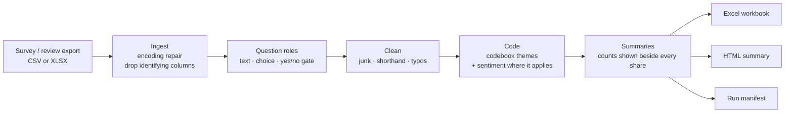

# Listening at Scale: Voice-of-Customer Pipeline v2

Turn Spanish-language survey and review exports into cleaned, coded themes and a privacy-safe insight report.

I built v1 of this pipeline while working as a UX researcher at an e-commerce consultancy in Monterrey, where post-purchase surveys and reviews from Shopify stores piled up faster than anyone could read them. v2 is the version I rebuilt after testing v1 on the kind of data it was made for and finding that it did not work.

[](https://github.com/SylviaZam/Automated-Review-Analysis-Pipeline/actions/workflows/ci.yml)

---

## Why v2 exists

v1 classified sentiment with VADER, an English-only lexicon, and sorted answers into six keyword buckets. The customers wrote in Mexican Spanish. When I ran v1 on about 1,300 real, published product reviews from BFit, a Mexican wellness brand (every one rated 4 or 5 stars), this is what came back:

| On ~1,300 real 4-5 star reviews | v1 (2025) | v2 |
|---|---|---|
| Labelled **Positive** | 15.7% | **80.7%** |
| Labelled **Negative** (all false alarms) | 17.9% | **2.6%** |
| Left in the catch-all bucket ("General" / "Other") | 82.6% | 34.1% |

The v1 report looked finished. Its numbers were wrong. v2 fixes the method rather than the formatting:

| Problem in v1 | What v2 does |
|---|---|
| English-only sentiment | Spanish-first lexicon with negation ("no funcionó"), contrast ("pero", "aunque") and emoji |
| Six generic buckets; the API mode invented its own category names, so brands could not be compared | One **codebook** of 21 themes, consolidated from my manual affinity coding across brands and extended by diagnosing each export; the model backend must choose from it |
| Sentiment forced onto every question | Each question gets a **role** (why they bought, what almost stopped them, product-page blocker...). Only opinion questions get sentiment |
| Typos, texting shorthand and junk answers counted as data | **Cleaning step**: junk detection, shorthand expansion, typo repair (details below) |
| Multi-select questions coded as if they were free text, inflating counts and theme shares | Detected and tallied per option instead (`voc diagnose` flags them) |
| One vocabulary for every industry | Shared themes plus [industry packs](codebooks/) and per-brand keyword files proposed by `voc diagnose` |
| Broken encodings (`Cu√©ntanos`, `ÀC\x97mo`) | File- and cell-level encoding repair |
| Names, emails, cities and IPs flowed into outputs and a committed cache | Identifying columns dropped at ingest, contact details masked in free text, spend kept as a band, cache stores hashes only |
| Failed API calls silently became "Neutral" | Failures are flagged and counted in a run manifest |
| No way to know if it was right | Evaluation harness with a hand-labelled answer key, per-theme precision/recall and coder agreement (Cohen's kappa) |

## What it produces

For each export: an Excel workbook for analysts, a one-page HTML summary that is safe to share, and a JSON run manifest.

Open [examples/output/](examples/output/) to see all three for the synthetic demo datasets.



## Quick start (offline, no API key)

```bash
python3 -m venv .venv && source .venv/bin/activate
pip install -r requirements.txt

python -m voc synth                     # writes synthetic demo data to data/synthetic
python -m voc run data/synthetic/wellness_post_purchase.csv --label "Demo wellness" --out output
python -m voc eval data/synthetic/gold_labels.csv   # v1 vs v2 on the synthetic answer key
```

Commands:

| Command | Purpose |
|---|---|
| `voc run <export>` | Analyse one export. `--label` sets the dataset name used in outputs. `--quotes` adds cleaned answers to the Excel for internal use only. |
| `voc eval <gold.csv>` | Score backends (`v1`, `rules`, `claude`, `openai`) against a hand-labelled answer key. |
| `voc diagnose <export>` | Check a brand's export before coding it: question kinds, coverage gaps, candidate vocabulary. |
| `voc label-kit <export>` | Sample real answers into a labelling sheet that stays on your machine. |
| `voc synth` | Regenerate the synthetic demo datasets and their answer key. |

### Model backends (optional)

Keyword rules miss answers that carry meaning without trigger words. For those, a language model can do the coding. Both model backends send answers in batches of 20, with the codebook as a JSON schema, so every label is a valid theme id rather than a made-up category. Results are cached by SHA-256 hash (no answer text is stored), and failed batches are flagged instead of being counted.

```bash
pip install anthropic          # or: pip install openai
python -m voc run export.csv --backend claude --label "BFit post-purchase"
python -m voc eval gold.csv --backends v1 rules claude   # measure before trusting it
```

| Backend | Credentials | Default model | Notes |
|---|---|---|---|
| `claude` | `ANTHROPIC_API_KEY` (or an `ant auth login` profile) | `claude-opus-5` at low effort | Structured outputs (`output_config.format`); the codebook sits in a cached system prompt; server-side refusal fallback on Opus 5. Change with `--model` / `VOC_CLAUDE_MODEL`, and effort with `VOC_CLAUDE_EFFORT`. |
| `openai` | `OPENAI_API_KEY` | `gpt-4o-mini` | Strict JSON-schema response format. Change with `--model` / `VOC_OPENAI_MODEL`. |

Put keys in `.env` (see `.env.example`), never in code. The offline `rules` backend is the default and is what the numbers on this page describe. The model backends have not yet been scored on the real hand-labelled set.

## Supported exports

Detected from the headers, no configuration needed:

- **Post-purchase surveys** (KNO, Fairing, Zigpoll): one column per question. Question roles are recognised from Spanish or English wording, for example "¿Qué te causaba incertidumbre antes de comprar?" → `hesitation`.
- **Product-page polls**: a yes/no gate ("¿Tienes alguna duda que te dificulte comprar?") plus an open follow-up. The report shows the share of visitors who had a blocker and what the blockers were.
- **Review exports**: `title`, `body`, `rating`, `product_handle`. The title is merged into the body, and rating-based sentiment is kept alongside text sentiment.
- **v1 format**: `Email, Name, Products, Q1..Qn`.

Unusual exports: `--roles roles.json` maps column headers to roles. `--extra-keywords extra.json` adds brand-specific terms (product or influencer names) to a theme without editing the shared codebook.

## Diagnose a brand before coding it

The codebook is deliberately shared, so results can be compared across brands. That only works if you check each export first:

```bash
python -m voc diagnose export.csv --label "BFit" --extra-keywords codebooks/supplements.json
```

The report lists what each question actually is, and flags three things that quietly ruin a study:

- **Multi-select questions being read as free text.** One store's "why did you buy?" was a pick-list whose options the export joined with commas. 1,654 answers were being coded as if customers had written them, which inflated both the answer count and every theme share for that brand.
- **Coverage gaps.** The share of answers the codebook cannot place, per question. Above 25% the report tells you to fix the codebook before labelling or reporting anything.
- **Two exports pasted side by side.** Same question in two columns with different answers, which silently mixes two populations in one base.

It then proposes vocabulary: the phrases that recur inside the answers nothing matched, with examples, plus a draft keyword file to fill in. Nothing is applied automatically; a researcher accepts or rejects each phrase. Running this on the real exports is how `first_time_trial` ("quiero probar la marca", "nunca había comprado"), `loyalty_rewards` and `site_usability` entered the codebook.

### New themes per brand

Themes differ by business. A supplement brand talks about dosage and results; a jewelry brand talks about karats and whether the store is real. The shared codebook covers what brands have in common; `--propose-themes` drafts the rest, per analysis:

```bash
# offline: groups unplaced answers by the phrases distinctive to them
python -m voc diagnose export.csv --label "BFit" --propose-themes 6

# or have Claude read a sample of them and name the themes
python -m voc diagnose export.csv --label "BFit" --propose-themes 6 --propose-backend claude

# review the draft, delete what is not real, then use it
python -m voc run export.csv --extra-themes output/bfit_themes_draft.json
```

A proposal must be *distinctive*, not merely frequent: the phrase has to appear in the unplaced answers well above its rate in the export as a whole, which is what separates "brenvita" from "producto". The Claude proposer may not repeat a theme that already exists, and every proposal's answer count is measured by matching its keywords against the real answers rather than taken from the model's claim.

Accepted themes load with a `local_` prefix and are reported as brand-specific, so one brand's invention is never mistaken for a cross-brand measure. The shared themes stay untouched, which is what keeps brands comparable.

Category vocabulary lives in [codebooks/](codebooks/) (jewelry, footwear, supplements, fragrance, fashion); brand-specific words belong in a brand file. The shared themes never change, so brands stay comparable.

## Cleaning: typos and junk answers

Real survey answers are messy. `voc/clean.py` runs before coding:

- **Junk is removed from every base** and counted by reason: empty, digits or punctuation only, single letters, "test"/"hola", repeated characters, keyboard mashing. "No", "nada" and "N/A" are kept, because "nothing worried me" is an answer. So are "10/10" and emoji-only reviews.
- **Shorthand is expanded**: `q` → que, `xq` → porque, `tmb` → también.
- **Stretched words are collapsed**: `encantaaaa` → encanta.
- **Typos are repaired conservatively.** A word is changed only when all of these hold:
  - it is not a known Spanish or English word form (checked against [wordfreq](https://github.com/rspeer/wordfreq) lists, which include conjugations and unaccented spellings);
  - it is one physical slip from a known word (missing letter, extra letter, swapped letters, or a neighbouring key);
  - the first letter is unchanged;
  - the change is not just a different word ending (endings are usually inflections, not typos).
  
  The export itself also works as a dictionary, so product names that customers spell consistently are learned rather than "fixed".

The original answer is always kept next to the cleaned one.

On six real exports (about 7,700 responses and 9,200 open answers, a sample of a report that ran every two weeks for two years), cleaning removed 73 junk answers and repaired typos in 305 answers. Typical fixes: `calidsd` → calidad, `prodcutos` → productos, `etrega` → entrega, `ninguo` → ninguno. An early version was too aggressive (`hago` → pago, `premios` → precios); the rules above came from reviewing those errors.

## Evaluation

Two layers, reported separately on purpose:

1. **Real exports, aggregate only** (the table at the top). Star ratings act as a partial answer key for sentiment. For themes, I compared v2 against my own manual tally of Divain's post-purchase survey (113 buyers). v2 agreed with me on the top two reasons for choosing the brand (quality and longevity, then price) and on the top two worries (quality and longevity, then not knowing or trusting the brand). It undercounted product variety (5 answers against my 13) and left about a quarter of answers as "Other" (curiosity, a specific scent). Closing those gaps is what the model backend and codebook extensions are for.
2. **Synthetic development set** ([docs/evaluation_synthetic.md](docs/evaluation_synthetic.md)): 400 generated answers with known labels.

   | | Theme accuracy | Theme macro-F1 | Sentiment accuracy |
   |---|---|---|---|
   | v1 | 20.0% | 0.16 | 37.5% |
   | v2 rules | 93.0% | 0.86 | 100% (n=56) |

   These v2 numbers are optimistic. I wrote both the templates and the rules, and I fixed general gaps after reading the errors. Treat this as a regression test, not a benchmark.

The benchmark that matters is a **hand-labelled sample of real answers**, and it is the next step: `voc label-kit` has sampled 200 real answers, which I am labelling blind. I will then re-label 50 of them a week later to measure my own consistency (Cohen's kappa), and `voc eval` will score each backend against those labels. Results will be added here as aggregates. See [docs/evaluation.md](docs/evaluation.md).

## Privacy by design

Client data never enters this repository. The public demo runs on synthetic data, and [scripts/check_no_pii.py](scripts/check_no_pii.py) runs in CI to block:
- real email addresses and IP addresses;
- API-key shaped strings;
- any names added to the blocklist (compared by SHA-256, so the list itself reveals nothing).

When the pipeline runs on real data:
- identifying columns are dropped before analysis;
- contact details typed into answers are masked;
- spend is banded;
- shares are only charted for bases of 30 or more, and counts under 5 print as "<5";
- the HTML summary never contains verbatim answers.

Details: [docs/privacy.md](docs/privacy.md).

## Repository layout

```
voc/                 pipeline package (ingest, questions, clean, codebook, sentiment, classify, pipeline, reports, evaluate, synth, cli)
voc/codebook.json    the shared codebook (21 themes)
codebooks/           industry keyword packs
data/synthetic/      generated demo exports + answer key (no real people)
examples/output/     reports generated from the synthetic data
docs/                method, privacy, evaluation, codebook
legacy/              v1 script and its example input/output, kept for comparison
scripts/             privacy guard
tests/               127 tests
```

## Limitations

- Keyword rules miss meaning without trigger words ("que fuera puro marketing" reads as an ingredients comment). The model backends are built for these cases; measure them with `voc eval` before trusting them.
- Sentiment is a lexicon, not a model. Sarcasm fails.
- Typo repair skips words shorter than four letters and can still pick the wrong neighbour for rare words.
- Theme shares describe the people who answered an optional survey, not all customers.

## History

- **2023-2024**: manual affinity coding in spreadsheets, then prompt prototypes, while running customer-data analysis for e-commerce clients.
- **2025, v1**: packaged the workflow as a public script (see `legacy/`).
- **2026, v2**: audited v1 on real data, then rebuilt the method and added cleaning, privacy controls and evaluation. v2 was built with AI coding assistance (Claude). The codebook themes come from my manual coding of client data.

MIT License.
